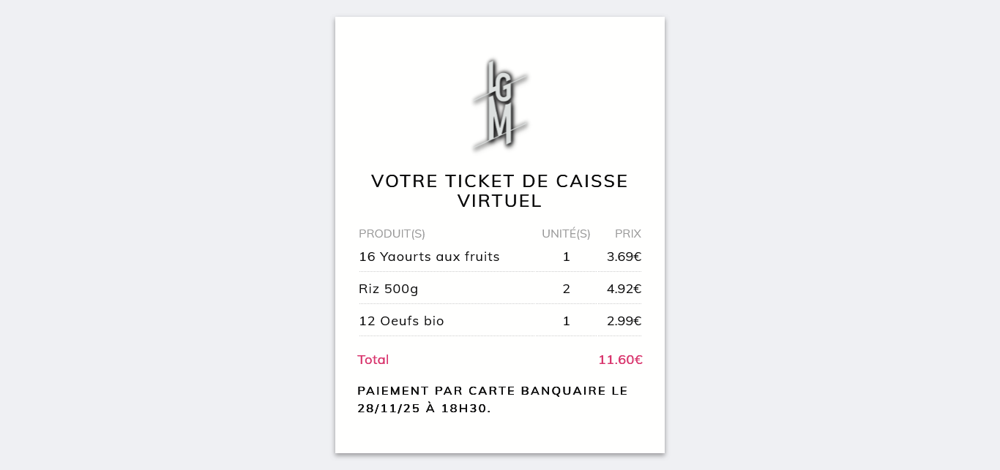

## VOTRE TICKET DE CAISSE VIRTUEL 🧾

## Le challenge

Création d'un ticket de caisse virtuel en HTML5 et CSS3.

## Démonstration

Lien vers le projet : https://aperbet56.github.io/votre_ticket_de_caisse_virtuel/

## Projet développé avec

- Utilisation des balises sémantiques HTML5
- CSS3
- Flexbox
- Element HTML5 table
- Animations CSS (@keyframes)
- Desktop first
- Page web responsive
- Importation de la police "Muli"
- Utilisation d'un normaliseur : le fichier normalize.css
